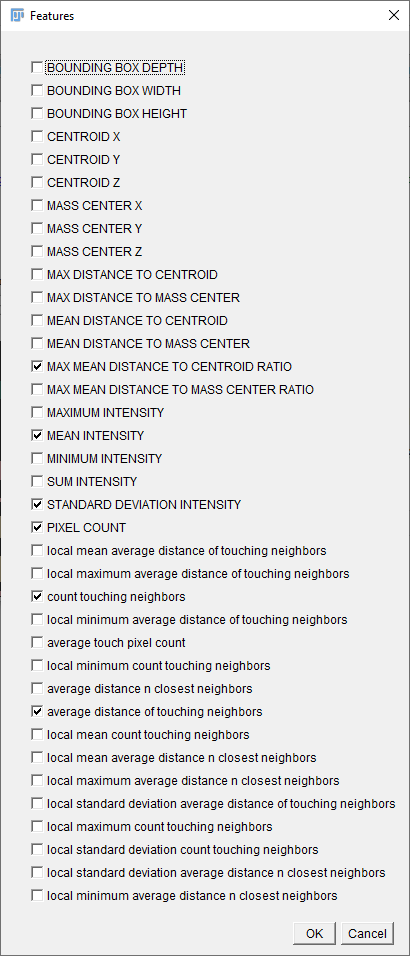

# Label classification (Weka)
Labels in label images can be classified according to their shape and size or to intensity measurements derived from a 
corresponding intensity image. 

### How to do label classification
Open your data set. [Start the CLIJx-Assistant](https://clij.github.io/assistant/getting_started) and follow these steps:

* Your dataset
  * CLIJx-Assistant Starting point
    * Thresholding (e.g. Otsu)
      * Connected Components Labeling
        * Weka Label Classifier
        
In the dialog of the classifier, make sure to select the right intensity input image.

<iframe src="images/weka_object_classifier.mp4" width="540" height="260"></iframe>
[Download video](images/weka_object_classifier.mp4)

Furthermore, choose the right features, depending on your desired analysis (shape, intensity), by clicking on the "Features..." button:

The model will then be saved to the specified file location when you hit the "Train" button.

Note: For technical reasons, the model files are not compatible with traditional Trainable Weka Segmentation.

Back to [CLIJx-Assistant](https://clij.github.io/assistant)

[Imprint](https://clij.github.io/imprint)
