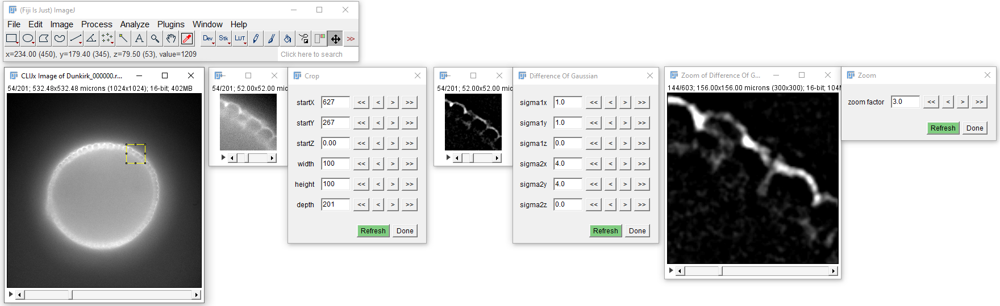

# Crop, Pan & Zoom
When optimizing workflows, is might make sense to do that on a sub-volume of a bigger stack, just to spare time while optimizing parameters.
Therefore, there is a Crop operation for cropping a sub-region. This sub-region can be panned while more operations are
attached to its result. Furthermore, there is a Zoom operation for inspecting results in more detail.

## How to crop, pan and zoom
Open your data set. [Start the CLIJx-Assistant](https://clij.github.io/assistant/getting_started) and follow these steps:

* Your dataset
  * CLIJx-Assistant Starting point
    * Crop
      * [Optional: Post-processing, such as Background subtraction]
        * Zoom
            
<iframe src="images/assistant_crop_pan_zoom.mp4" width="540" height="540"></iframe>
[Download video](images/assistant_crop_pan_zoom.mp4) [Image data source: Daniela Vorkel, Myers lab, CSBD / MPI CBG]

Back to [CLIJx-Assistant](https://clij.github.io/assistant)

[Imprint](https://clij.github.io/imprint)
