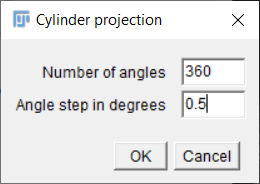
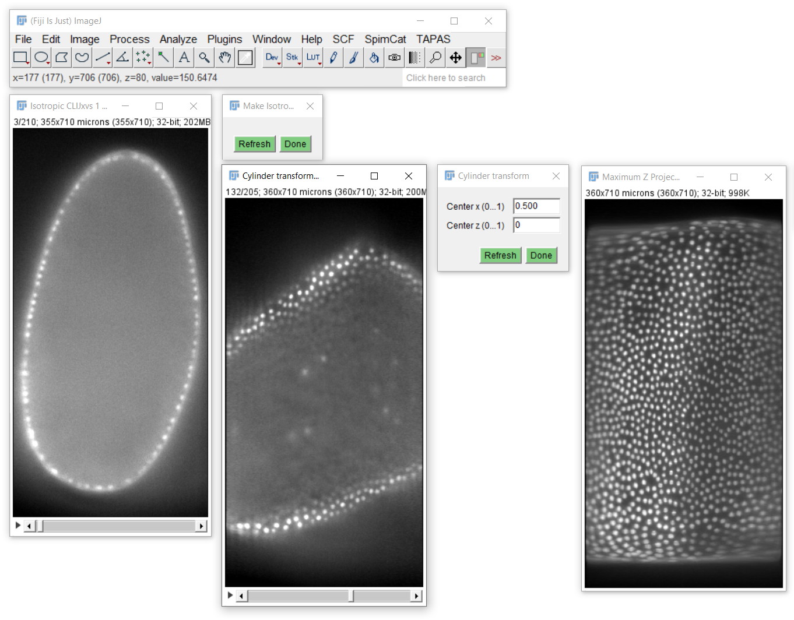

# Cylinder projection
The cylinder projection is typically used to project intensities from a spherical or cylindrical sample into a 2D image.

## How to use a cylinder projection on your data
When applying cylinder projections to image stacks, a rigid dransform in advance is helpful to have control of the position and tilt of your sample in projected space.

Open your time lapse data set. [Start the CLIJx-Incubator](https://clij.github.io/incubator/getting_started) and follow these steps:

* Your dataset
  * CLIJx-Incubator Starting point
    * [Optional: Noise removal and Background subtraction]
      * Make Isotropic
        * Rigid transform
          * Cylinder transform
            * Maximum Z projection

<iframe src="images/incubator_rigid_cylinder_max.mp4" width="540" height="540"></iframe>
[Download video](images/incubator_rigid_cylinder_max.mp4) [Image data source: Daniela Vorkel, Myers lab, CSBD / MPI CBG]

## Half-cylinder projection
If just half of a sample was imaged, you may want to apply a half-cylinder projection. 
You can do this by entering 
* number of angles: 360 and
* delta angle in degrees: 0.5
which results in a projection over 180 degrees. 

In this case, you may also want to move the projection center to 0.  

A flip operation may also make sense in advance to reverse the order of the image in the stack.

Back to [CLIJx-Incubator](https://clij.github.io/incubator)