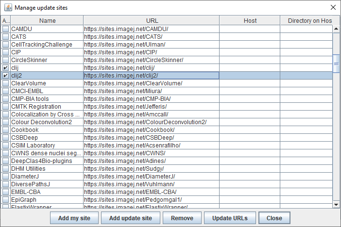
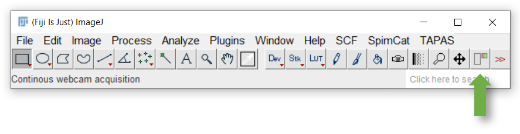
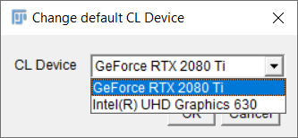
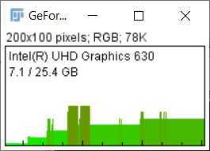

# CLIJx-Incubator installation instructions
CLIJx-Incubator is under development. Please install it only in a separate Fiji installation. 
Do not use it for routine research yet. Planned release is early 2021. Stay tuned.

* Download and unpack [Fiji](https://fiji.sc)
* Start Fiji and run its update using the menu `Help > Update`


* Click on "Manage update sites" and activate the two updates sites "clij" and "clij2". Furthermore, please click on 
"Add update site" and enter another "CLIJx-Incubator" update site with the URL "https://sites.imagej.net/clincubator/"



* Click on "Close"
* Click on "Apply Changes"
* Restart Fiji

Installation was successful if you find the CLIJx-Incubator starting point button in Fijis tool bar:



In case of any issues, please refer to the more detailed [installation instructions of CLIJ2](https://clij.github.io/clij2-docs/installationInFiji) and
the [trouble shooting](https://clij.github.io/clij2-docs/troubleshooting) section.

<a name="windows"></a>
## Windows specific installation
Windows users may have to install graphics cards drivers downloaded from the vendors website ([AMD](https://www.amd.com/en/support), [NVidia](https://www.nvidia.com/Download/index.aspx)). The driver delivered by Windows Update is not sufficient.

<a name="macos"></a>
## MacOS specific installation
When using an AMD graphics card in recent Macs, you may want to turn **OFF** the option "Automatic graphics switching" under System Preferences / Energy Saver. Thanks to [Tanner Fadero for finding this out](
https://forum.image.sc/t/ijm-macro-crashes-after-a-few-loops/40130/17).

<a name="linux"></a>
## Linux specific installation
Also under linux, installation of drivers from the vendors website is necessary ([AMD](https://www.amd.com/en/support), [NVidia](https://www.nvidia.com/Download/index.aspx)). Furthermore, when working with Intel graphics, it might be necessary to install packages such as "ocl-icd-devel" to make Fiji / CLIJ discover the right GPU devices.

<a name="hardware"></a>
## Hardware requirements
CLIJx-Incubator uses modern graphics cards to ensure real-time image processing experience. 
Therefore it is recommended to utilize state-of-the art graphics computing units (GPUs). 
When considering purchasing modern GPUs, please take into account:
* **Memory size**: As image processing is [memory-bound](https://en.wikipedia.org/wiki/Memory_bound_function) look out for GPUs with 
large memory. For typical scenarios it is recommended to buy GPUs with at least 8 GB of GDDR6 RAM memory.
* **Memory Bandwidth**: GPU vendors specify their products computing capabilities with various terminology and metrics. 
 look out for memory bandwidth: typical GDDR4-based GPUs have a memory bandwidth > 400 GB/s. 
 Quite some GDDR5 GPUs for example offer < 100 GB/s. 
 Thus, GDDR6-based GPUs may compute image processing results about 4 times faster!
* **Integrated GPUs**: If you desire processing images in long workflows, it might make sense to use integrated GPUs with access to huge amounts of DDR4-memory. 
They are more affordable.

You can check the capabilities of your graphics processing units by selecting a device using the menu `Plugins > ImageJ on GPU (CLIJx) > Change default CL device```



The menu `Plugins > ImageJ on GPU (CLIJx) > Memory Display` allows you to overview available memory and memory consumption while building your workflow.



Back to [CLIJx-Incubator](https://clij.github.io/clincubator)
