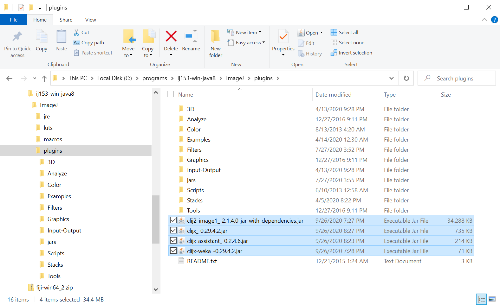
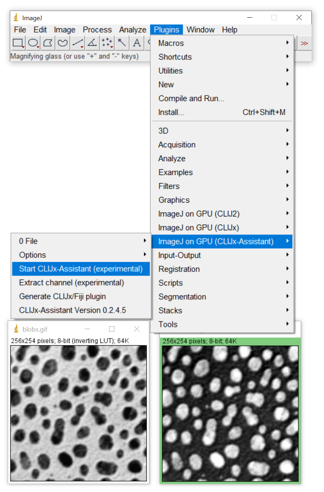
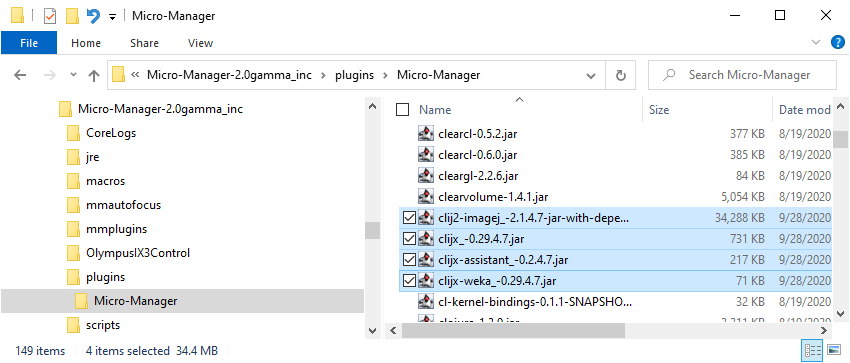

# CLIJx-Assistant installation instructions
CLIJx-Assistant is under development. Please install it only in a separate Fiji installation. 
Do not use it for routine research yet. Planned release is summer 2021. Stay tuned.

<a name="fiji"></a>
## Installation in Fiji
* Download and unpack [Fiji](https://fiji.sc)
* Start Fiji and run its update using the menu `Help > Update`


* Click on "Manage update sites" and activate the _three_ updates sites "clij", "clij2" and "clijx-assistant".


* Click on "Close"
* Click on "Apply Changes"
* Restart Fiji

Installation was successful if you find the CLIJx-Assistant starting point button in Fijis tool bar:


<a name="extensions"></a>
## Optional: Extensions
There are extensions available, e.g. for 
[BoneJ](https://bonej.org),
[ImageJ](https://imagej.nih.gov/ij/index.html), 
[ImageJ2](https://imagej.net), 
[ImageJ 3D Suite](https://imagejdocu.tudor.lu/plugin/stacks/3d_ij_suite/start), 
[Imglib2](https://github.com/imglib/imglib2/), 
[MorphoLibJ](https://github.com/ijpb/MorphoLibJ) and 
[SimpleITK](https://simpleitk.org). To make use of them,
please also activate these update sites:
* clijx-assistant-extensions
* 3D ImageJ Suite
* BoneJ
* IJPB-Plugins

<a name="imagej"></a>
## Installation in ImageJ
Download and upack [ImageJ](https://imagej.nih.gov/ij/download.html) and some jar-files:
 
* [clij2-imagej_-2.2.0.19-jar-with-dependencies.jar](https://github.com/clij/clij2-imagej1/releases/download/2.2.0.19/clij2-imagej_-2.2.0.19-jar-with-dependencies.jar)
* [clijx-weka_-0.30.1.19.jar](https://github.com/clij/clijx/releases/download/0.30.1.19/clijx-weka_-0.30.1.19.jar)
* [clijx_-0.30.1.19.jar](https://github.com/clij/clijx/releases/download/0.30.1.19/clijx_-0.30.1.19.jar)
* [clijx-assistant_-0.4.2.19.jar](https://github.com/clij/assistant/releases/download/0.4.2.19/clijx-assistant_-0.4.2.19.jar)

Please put these jar files in the `plugins` sub-directory of ImageJ:



Installation in ImageJ was ok, if the menu `Plugins > ImageJ on GPU (CLIJx-assistant)` appeared. 
Click on `Start CLIJx-Assistant` to try it out. 
If a window with a green frame appears, it worked!


<a name="micromanager"></a>
## Installation in MicroManager 2
Download and install [MicroManager 2](https://micro-manager.org/wiki/Download_Micro-Manager_Latest_Release) and some jar files:

* [clij2-imagej_-2.2.0.19-jar-with-dependencies.jar](https://github.com/clij/clij2-imagej1/releases/download/2.2.0.19/clij2-imagej_-2.2.0.19-jar-with-dependencies.jar)
* [clijx-weka_-0.30.1.19.jar](https://github.com/clij/clijx/releases/download/0.30.1.19/clijx-weka_-0.30.1.19.jar)
* [clijx_-0.30.1.19.jar](https://github.com/clij/clijx/releases/download/0.30.1.19/clijx_-0.30.1.19.jar)
* [clijx-assistant_-0.4.2.19.jar](https://github.com/clij/assistant/releases/download/0.4.2.19/clijx-assistant_-0.4.2.19.jar)

Please put these jar files in the `plugins\Micro-Manager` sub-directory of MicroManager:


Start MicroManager and check if the installation worked as in the [ImageJ](https://clij.github.io/assistant/installation#imagej) section above.
During multi-dimenionsal acquisition, just Start CLIJx-Assistant and use the right click menu to setup a workflow:


<a name="troubleshooting"></a>
## Troubleshooting
In case of any issues, please refer to the more detailed [installation instructions of CLIJ2](https://clij.github.io/clij2-docs/installationInFiji) and
the [trouble shooting](https://clij.github.io/clij2-docs/troubleshooting) section.

<a name="windows"></a>
## Windows specific installation
Windows users may have to install graphics cards drivers downloaded from the vendors website ([AMD](https://www.amd.com/en/support), [NVidia](https://www.nvidia.com/Download/index.aspx)). The driver delivered by Windows Update is not sufficient.

<a name="macos"></a>
## MacOS specific installation
When using an AMD graphics card in recent Macs, you may want to turn **OFF** the option "Automatic graphics switching" under System Preferences / Energy Saver. Thanks to [Tanner Fadero for finding this out](
https://forum.image.sc/t/ijm-macro-crashes-after-a-few-loops/40130/17).

<a name="linux"></a>
## Linux specific installation
Also under linux, installation of drivers from the vendors website is necessary ([AMD](https://www.amd.com/en/support), [NVidia](https://www.nvidia.com/Download/index.aspx)). Furthermore, when working with Intel graphics, it might be necessary to install packages such as "ocl-icd-devel" to make Fiji / CLIJ discover the right GPU devices.

<a name="ijmmd"></a>
## Optional: ImageJ Macro Markdown Installation
If you want to export your workflows notebook style with [ImageJ Macro Markdown](https://github.com/haesleinhuepf/imagejmacromarkdown), 
please also activate the "IJMMD" update site in Fiji.

<a name="maven"></a>
## Optional: Plugin generator Installation
In order to build Fiji plugins, please install Java Development kit, version 8 or higher, e.g. [OpenJDK](https://openjdk.java.net/).
Furthermore, please download and install [git](https://git-scm.com/) and [maven](https://maven.apache.org/). 
For technical reasons, the `/bin/` folder of the `git` installation must be added to the PATH of the operating system. 
Furthermore, it is recommended to add maven to the path as well.   
(How to: 
[Windows](https://answers.microsoft.com/en-us/windows/forum/windows_10-other_settings/adding-path-variable/97300613-20cb-4d85-8d0e-cc9d3549ba23)
[Linux](https://opensource.com/article/17/6/set-path-linux)
[MacOS](https://support.apple.com/guide/terminal/use-environment-variables-apd382cc5fa-4f58-4449-b20a-41c53c006f8f/mac)
).

After installing git, maven and the JDK, please enter appropriate paths under `Plugins > ImageJ on GPU (CLIJx-Assistant) > Options > Build and Run options`


The above mentioned tools allow you to compile Fiji plugins. In order to edit the code conveniently, 
it is recommended to install an Integrated Development Environment (IDE) such as IntelliJ or Eclipse.

<a name="clic"></a>
## Optional: C++ compilation (CLIc / clEsperanto)
If you want to implement workflows using CLIc in C++, please follow the installation instructions [here](https://github.com/clEsperanto/CLIc_prototype).


<a name="icy"></a>
## Optional: Icy Protocol bridge
For exporting workflows to Icy Protocols, it might be handy to start Icy from ImageJ. Therefore, [download and install Icy](http://icy.bioimageanalysis.org/download/) 
and enter its location under `Plugins > ImageJ on GPU (CLIJx-Assistant) > Options > Build and Run options`.

<a name="te_oki"></a>
## Optional: Te Oki / Python Installation
If you want to run Python and/or Napari from Fiji, please install a conda environment, e.g. via [mini-conda](https://docs.conda.io/en/latest/miniconda.html).

Using conda, create a conda environment e.g. named te_oki:
```
conda create --name te_oki 
```
Activate the environment: 
```
conda activate te_oki 
```
Install dependencies, either via conda install or
```
pip install pyopencl napari ipython matplotlib numpy pyclesperanto_prototype scikit-image jupyter
```
Within this environment you can run generated [clEsperanto](https://clesperanto.github.io/) python scripts.

If the name of your conda environment differs, please configure it under `Plugins > ImageJ on GPU (CLIJx-Assistant) > Options > Build and Run options`

<a name="clijpy"></a>
## Optional: CLIJPY / PyImageJ / Python Installation
For running pyimagej python code, please follow the installation instructions on the [pyimagej github page](https://github.com/imagej/pyimagej).

<a name="hardware"></a>
## Hardware requirements
CLIJx-Assistant uses modern graphics cards to ensure real-time image processing experience. 
Therefore, it is recommended to utilize state-of-the art graphics computing units (GPUs). 
When considering purchasing modern GPUs, please take into account:
* **Memory size**: As image processing is [memory-bound](https://en.wikipedia.org/wiki/Memory_bound_function) look out for GPUs with 
large memory. For typical scenarios, it is recommended to buy GPUs with at least 8 GB of GDDR6 RAM memory.
* **Memory Bandwidth**: GPU vendors specify their products computing capabilities with various terminology and metrics. 
 Look out for memory bandwidth: typical GDDR5-based GPUs have a memory bandwidth < 100 GB/s. 
 Quite some GDDR6 GPUs for example offer > 400 GB/s. 
 Thus, GDDR6-based GPUs may compute image processing results about 4 times faster!
* **Integrated GPUs**: If you desire processing images in long workflows, it might make sense to use integrated GPUs with access to huge amounts of DDR4-memory. 
They are more affordable.

You can check the capabilities of your graphics processing units by selecting a device using the menu `Plugins > ImageJ on GPU (CLIJx) > Change default CL device```


The menu `Plugins > ImageJ on GPU (CLIJx) > Memory Display` allows you to overview available memory and memory consumption while building your workflow.


Back to [CLIJx-Assistant](https://clij.github.io/assistant)

[Imprint](https://clij.github.io/imprint)
