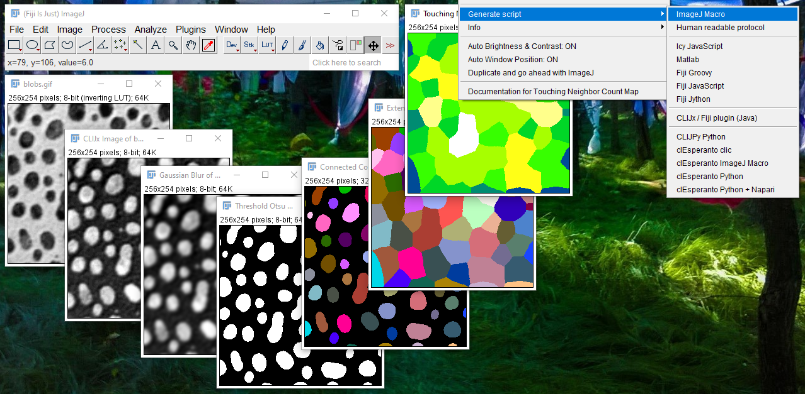

# Exporting workflows as ImageJ Macro
After you finished designing your image analysis workflow, you can export an ImageJ script and apply it to image sequences systematically.

Several languages are supported:

<iframe src="images/incubator_generate_macro.mp4" width="540" height="260"></iframe>
[Download video](images/incubator_generate_macro.mp4) [Image data source: Daniela Vorkel, Myers lab, CSBD / MPI CBG]

**Please note:** While CLIJx-Incubator is running, the GPU may be busy and full of images. 
Thus, before running your generated macro, close all CLIJx-Incubator windows.

Back to [CLIJx-Incubator](https://clij.github.io/incubator)
