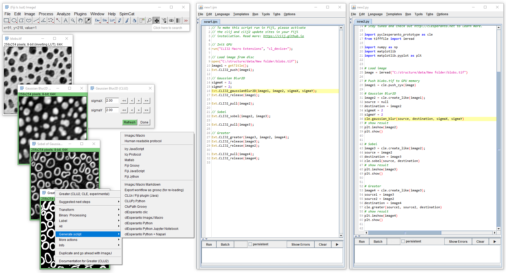

# Exporting workflows as ImageJ Macro
After you finished designing your image analysis workflow, you can export an ImageJ script and apply it to image sequences systematically.

Several languages are supported. Furthermore, you can export a script in multiple languages and compare:

<iframe src="images/incubator_generate_macro.mp4" width="600" height="300"></iframe>
[Download video](images/incubator_generate_macro.mp4) [Image data source: Daniela Vorkel, Myers lab, CSBD / MPI CBG]

# Exporting as ImageJ Macro Markdown notebook
If you want to export your workflow as ImageJ Macro Markdown notebook, please follow the 
[installation instructions](https://clij.github.io/assistant/installation#ijmmd)
<iframe src="images/clijxa_imagej_macro_markdown.mp4" width="540" height="260"></iframe>
[Download video](images/clijxa_imagej_macro_markdown.mp4)

**Please note:** While CLIJx-Assistant is running, the GPU may be busy and full of images. 
Thus, before running your generated macro, close all CLIJx-Assistant windows.

Back to [CLIJx-Assistant](https://clij.github.io/assistant)

[Imprint](https://clij.github.io/imprint)
