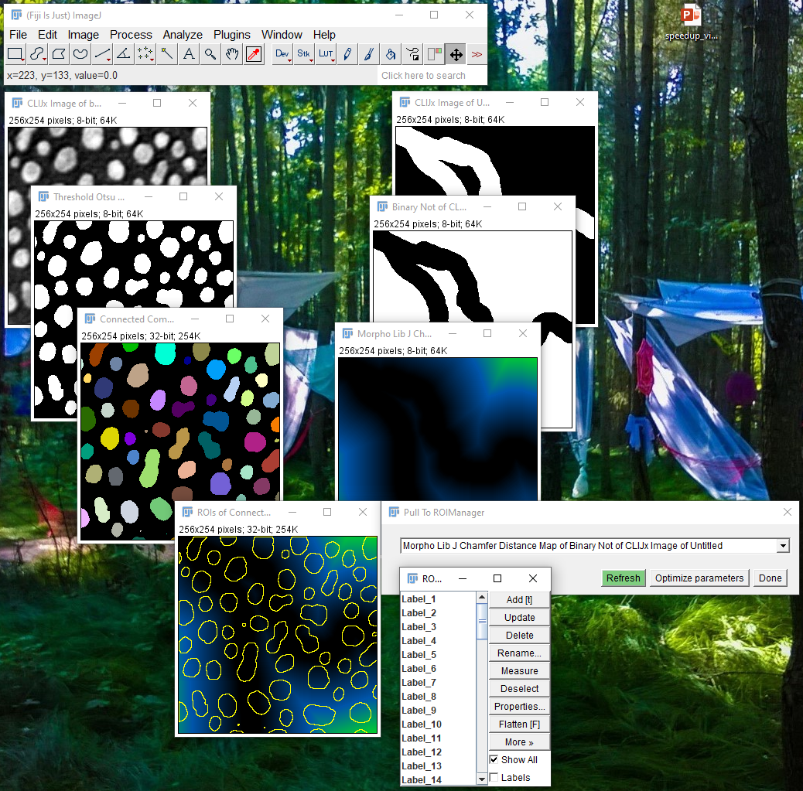

## Distance analysis MorpholibJ Chamfer distance map
Assuming one wants to analyse distances of cells towards a common structures such es vessels, one can exploit 
[MorpholibJs](https://imagej.net/MorphoLibJ) [Chamfer distance distance maps](https://imagej.net/MorphoLibJ.html#Distances_for_binary_images) to quantify distances.

### Installation
Activate the "IJPB-plugins" update site in Fiji.

### Application
 * Starting point: Intensity image showing nuclei 
   * Threshold Otsu 
     * Connected Components Labeling 
       * Pull To ROIManager 
 * Starting point: Binary image representing vessels... 
   * Binary Not 
     * Morpho Lib J Chamfer Distance Map 

Back to [CLIJx-Assistant](https://clij.github.io/assistant)

[Imprint](https://clij.github.io/imprint)
