## average_distance_of_touching_neighbors
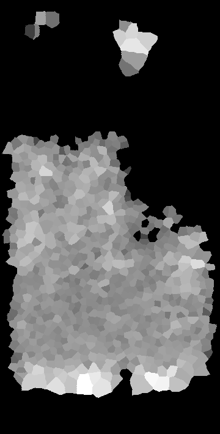;
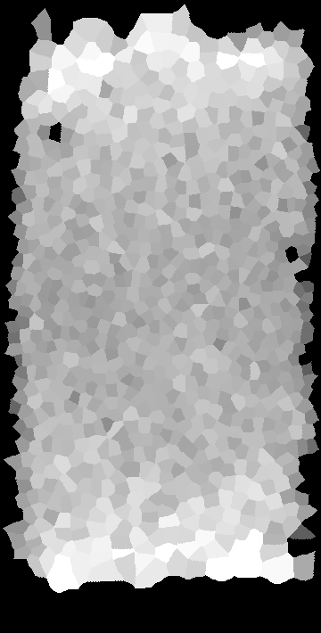;
## loca_standard_deviation_of_average_distance_of_touching_neighbors
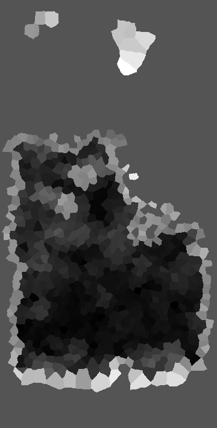;
;
## average_distance_of_1_closest_points
;
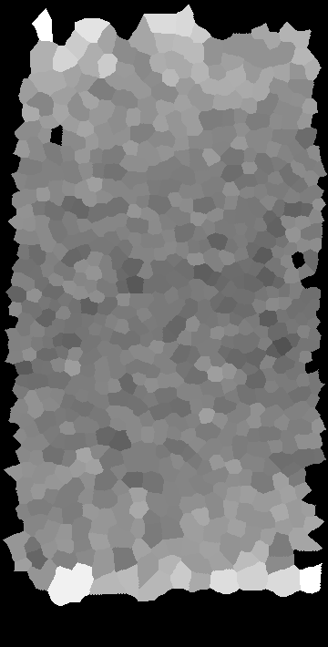;
## average_distance_of_2_closest_points
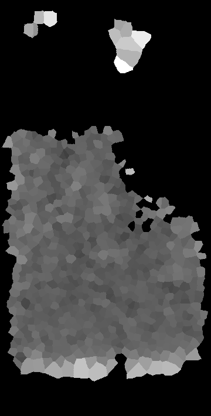;
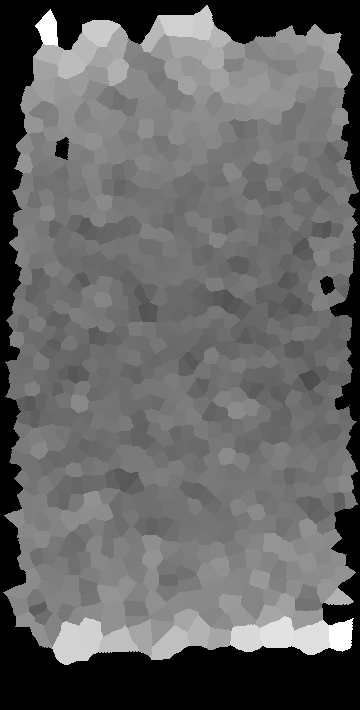;
## spot_detection__
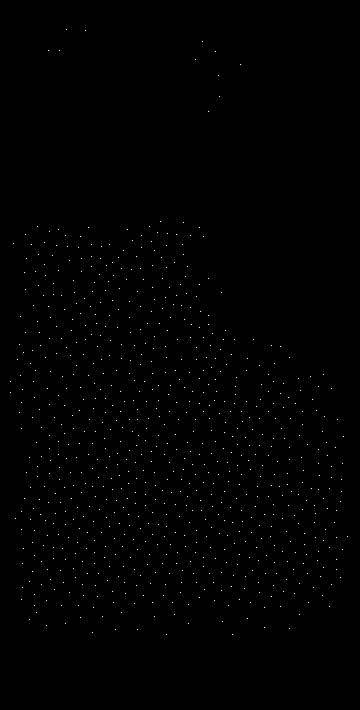;
;
## average_distance_of_3_closest_points
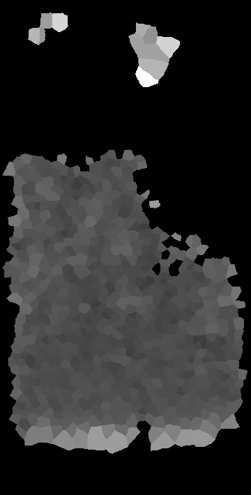;
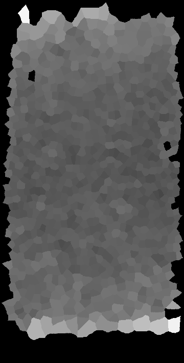;
## label_map
;
;
## average_distance_of_6_closest_points
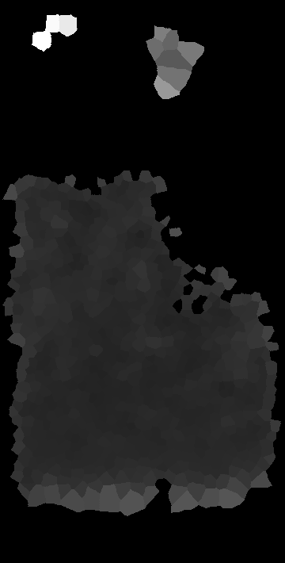;
;
## voronoi_diagram
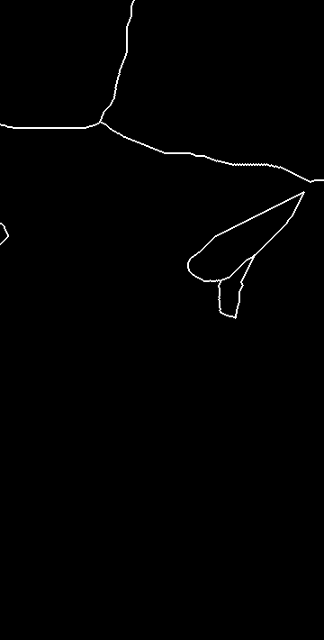;
;
## average_distance_of_10_closest_points
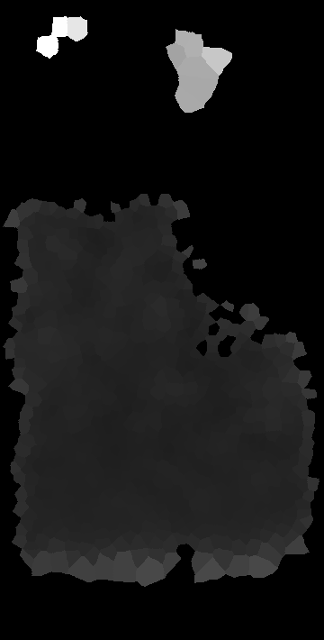;
;
## mesh_touching_neighbors
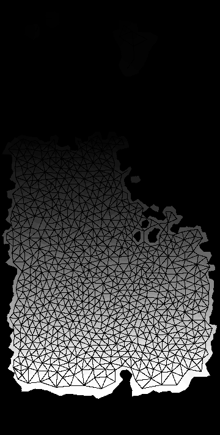;
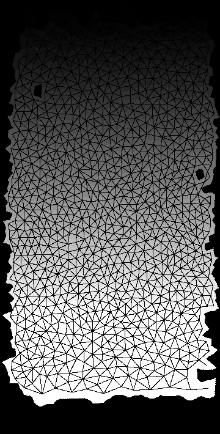;
## spot_density_locally_(radius_10)
_single.png);
.gif);
## distance_mesh_of_touching_neighbors
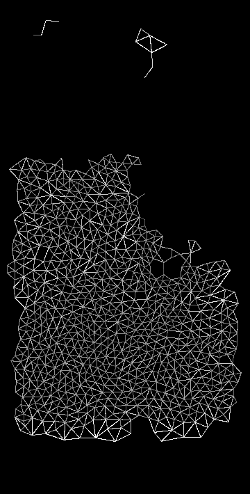;
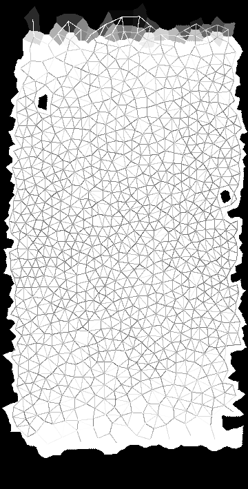;
## spot_density_locally_(radius_25)
_single.png);
.gif);
## touch_count_mesh
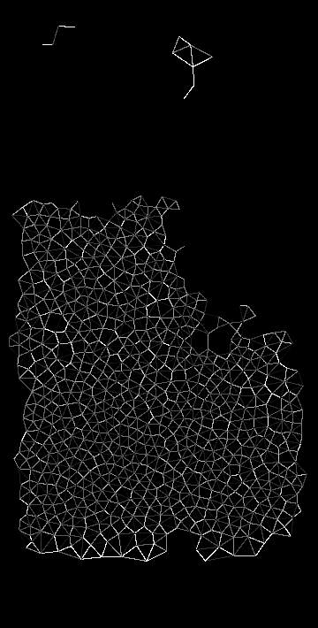;
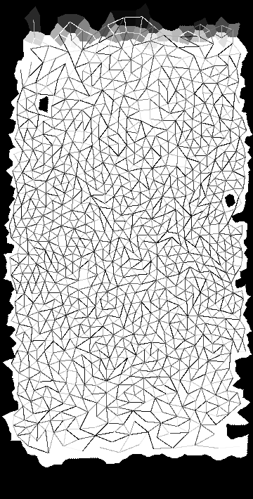;
## spot_density_locally_(radius_50)
_single.png);
.gif);
## touch_portion_mesh
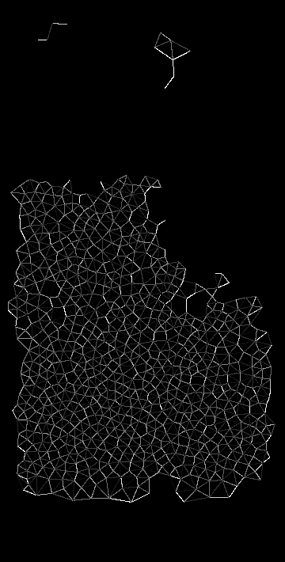;
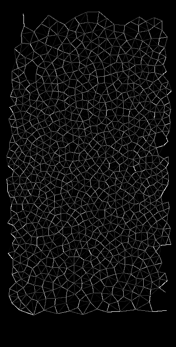;
## spot_density_locally_(radius_75)
_single.png);
.gif);
## mean_touch_portion_of_touching_neighbors
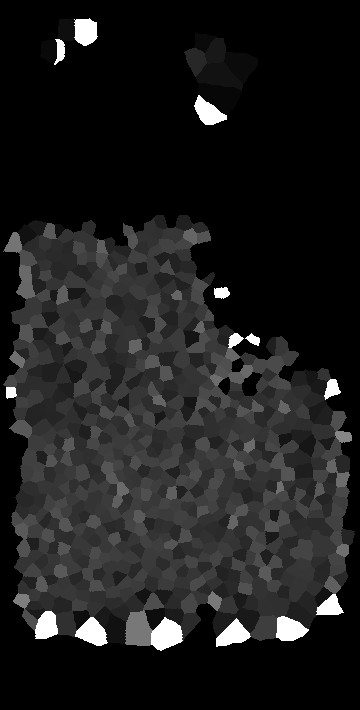;
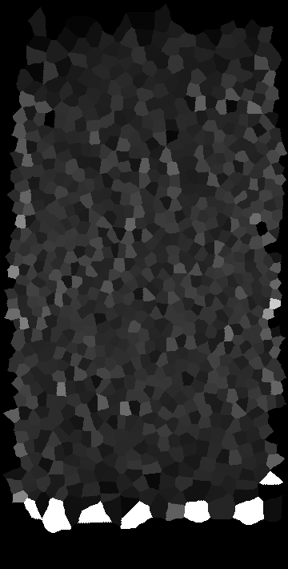;
## mean_intensity
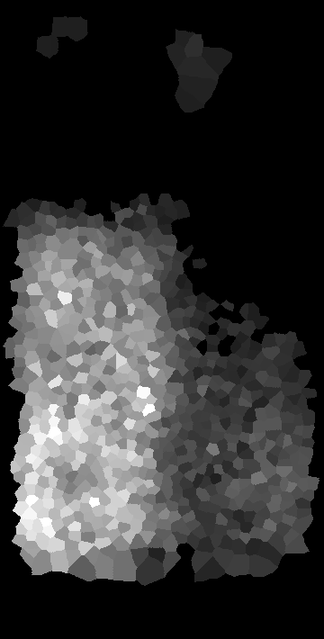;
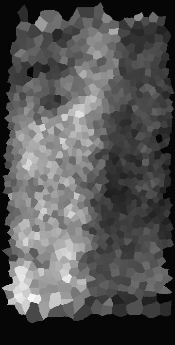;
## number_of_touching_neighbors
;
;
## minimum_intensity
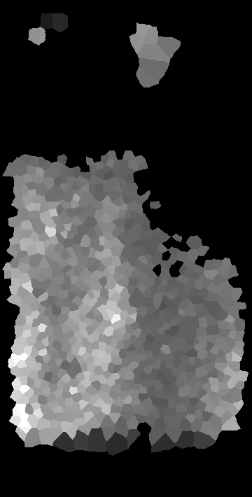;
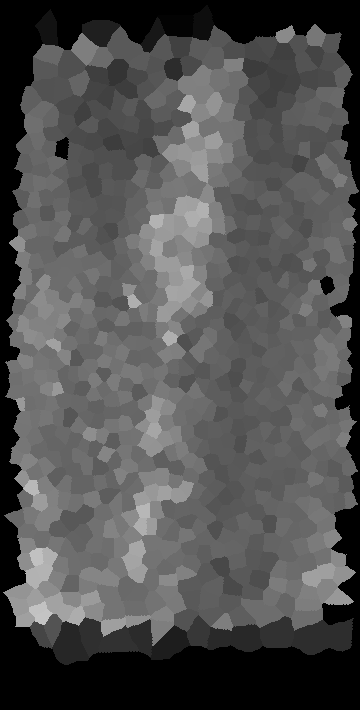;
## local_mean_number_of_touching_neighbors
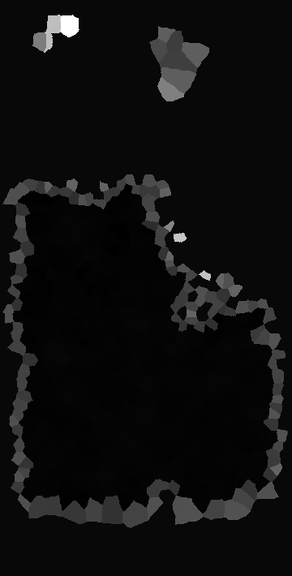;
;
## maximum_intensity
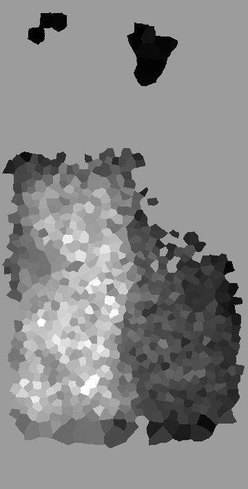;
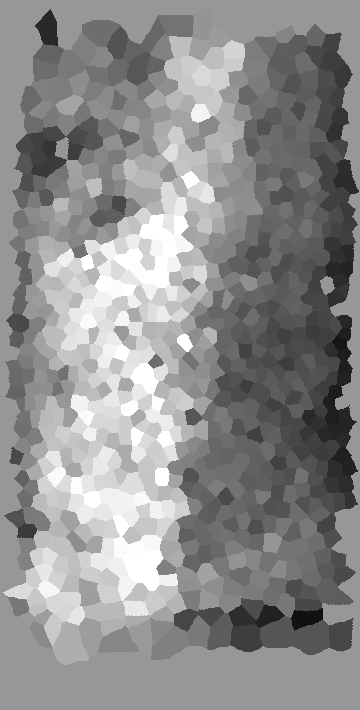;
## local_median_number_of_touching_neighbors
;
;
## standard_deviation_intensity
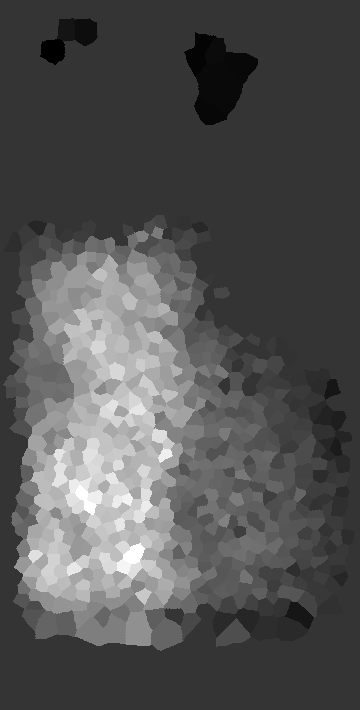;
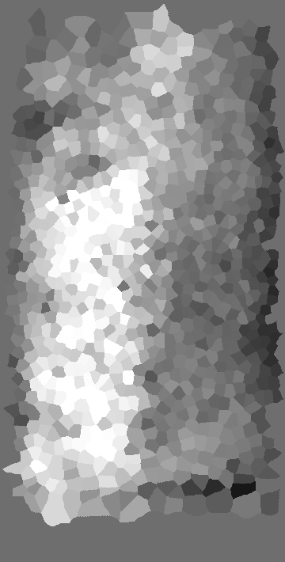;
## local_standard_deviation_number_of_touching_neighbors
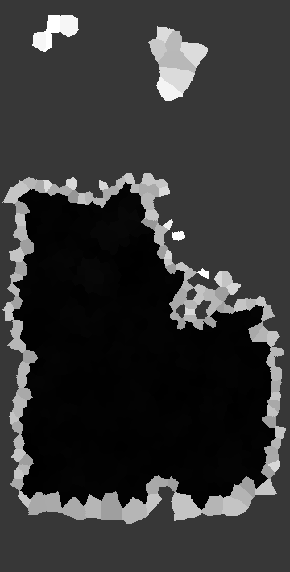;
;
## pixel_count
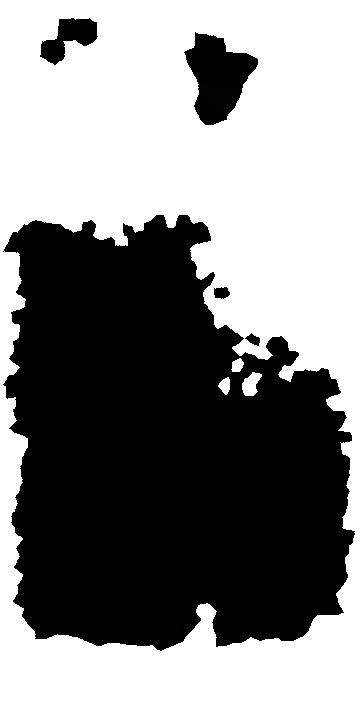;
;
## mean_distance_to_centroid
;
;
## mean_distance_to_mass_center
;
;
## max_distance_to_centroid
;
;
## max_distance_to_mass_center
;
;
## max_mean_distance_to_centroid_ratio
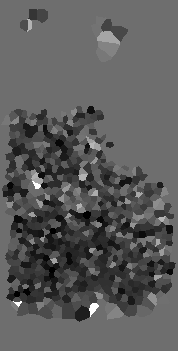;
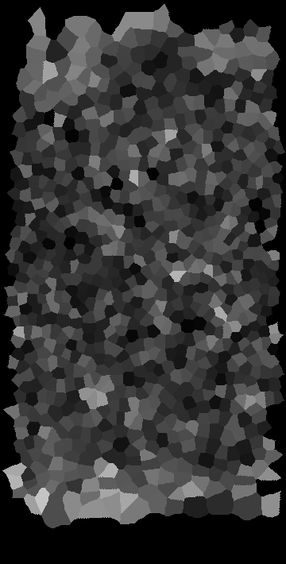;
## max_mean_distance_to_mass_center_ratio
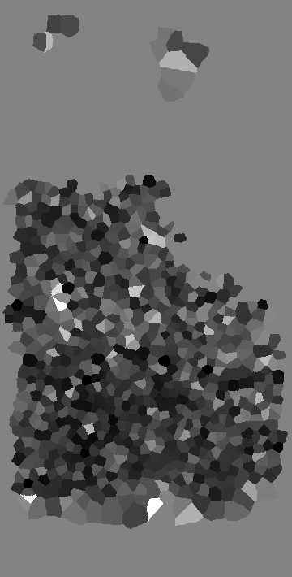;
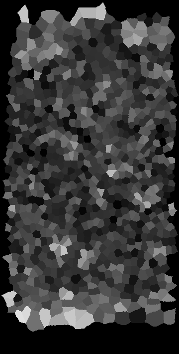;
