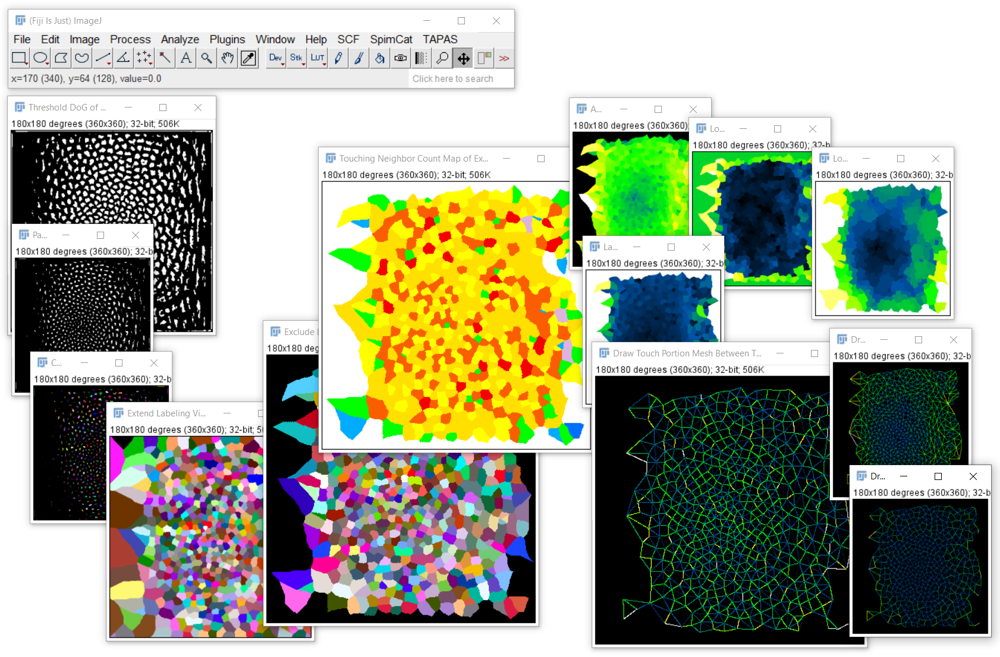

## Neighbor analysis

todo... :-)

* [Average Distance Of N Closest Neighbors Map](https://clij.github.io/clij2-docs/reference_averageDistanceOfNClosestNeighborsMap)
Takes a label map, determines distances between all centroids and replaces every label with the average distance to the n closest neighboring labels.

* [Average Neighbor Distance Map](https://clij.github.io/clij2-docs/reference_averageNeighborDistanceMap)
Takes a label map, determines which labels touch and replaces every label with the average distance to their neighboring labels.

* [Draw Distance Mesh Between Touching Labels](https://clij.github.io/clij2-docs/reference_drawDistanceMeshBetweenTouchingLabels)
Starting from a label map, draw lines between touching neighbors resulting in a mesh.

* [Draw Mesh Between Touching Labels](https://clij.github.io/clij2-docs/reference_drawMeshBetweenTouchingLabels)
Starting from a label map, draw lines between touching neighbors resulting in a mesh.

* [Draw Touch Count Mesh Between Touching Labels](https://clij.github.io/clij2-docs/reference_drawTouchCountMeshBetweenTouchingLabels)
Starting from a label map, draw lines between touching neighbors resulting in a mesh.

* [Draw Touch Portion Mesh Between Touching Labels](https://clij.github.io/clij2-docs/reference_drawTouchPortionMeshBetweenTouchingLabels)
Starting from a label map, draw lines between touching neighbors resulting in a mesh.

* [Label Maximum Extension Map](https://clij.github.io/clij2-docs/reference_labelMaximumExtensionMap)
Takes a label map, determines for every label the maximum distance of any pixel to the centroid and replaces every label with the that number.

* [Label Maximum Extension Ratio Map](https://clij.github.io/clij2-docs/reference_labelMaximumExtensionRatioMap)
Takes a label map, determines for every label the maximum distance of any pixel to the centroid and replaces every label with the that number.

* [Label Pixel Count Map](https://clij.github.io/clij2-docs/reference_labelPixelCountMap)
Takes a label map, determines the number of pixels per label and replaces every label with the that number.

* [Label Standard Deviation Intensity Map](https://clij.github.io/clij2-docs/reference_labelStandardDeviationIntensityMap)
Takes an image and a corresponding label map, determines the standard deviation of the intensity per label and replaces every label with the that number.

* [Local Maximum Average Distance Of N Closest Neighbors Map](https://clij.github.io/clij2-docs/reference_localMaximumAverageDistanceOfNClosestNeighborsMap)
Takes a label map, determines distances between all centroids, the mean distance of the n closest points for every point
 and replaces every label with the maximum distance of touching labels.

* [Local Maximum Average Neighbor Distance Map](https://clij.github.io/clij2-docs/reference_localMaximumAverageNeighborDistanceMap)
Takes a label map, determines which labels touch, the distance between their centroids and the maximum distancebetween touching neighbors. It then replaces every label with the that value.

* [Local Maximum Touching Neighbor Count Map](https://clij.github.io/clij2-docs/reference_localMaximumTouchingNeighborCountMap)
Takes a label map, determines which labels touch, determines for every label with the number of touching 
neighboring labels and replaces the label index with the local maximum of this count.

* [Local Mean Average Distance Of N Closest Neighbors Map](https://clij.github.io/clij2-docs/reference_localMeanAverageDistanceOfNClosestNeighborsMap)
Takes a label map, determines distances between all centroids, the mean distance of the n closest points for every point
 and replaces every label with the mean distance of touching labels.

* [Local Mean Average Neighbor Distance Map](https://clij.github.io/clij2-docs/reference_localMeanAverageNeighborDistanceMap)
Takes a label map, determines which labels touch, the distance between their centroids and the mean distancebetween touching neighbors. It then replaces every label with the that value.

* [Local Mean Touch Portion Map](https://clij.github.io/clij2-docs/reference_localMeanTouchPortionMap)
Takes a label map, determines which labels touch and how much, relatively taking the whole outline of 
each label into account, and determines for every label with the mean of this value and replaces the 
label index with that value.

* [Local Mean Touching Neighbor Count Map](https://clij.github.io/clij2-docs/reference_localMeanTouchingNeighborCountMap)
Takes a label map, determines which labels touch, determines for every label with the number of touching 
neighboring labels and replaces the label index with the local mean of this count.

* [Local Median Average Distance Of N Closest Neighbors Map](https://clij.github.io/clij2-docs/reference_localMedianAverageDistanceOfNClosestNeighborsMap)
Takes a label map, determines distances between all centroids, the mean distance of the n closest points for every point
 and replaces every label with the median distance of touching labels.

* [Local Median Average Neighbor Distance Map](https://clij.github.io/clij2-docs/reference_localMedianAverageNeighborDistanceMap)
Takes a label map, determines which labels touch, the distance between their centroids and the median distancebetween touching neighbors. It then replaces every label with the that value.

* [Local Median Touching Neighbor Count Map](https://clij.github.io/clij2-docs/reference_localMedianTouchingNeighborCountMap)
Takes a label map, determines which labels touch, determines for every label with the number of touching 
neighboring labels and replaces the label index with the local median of this count.

* [Local Minimum Average Distance Of N Closest Neighbors Map](https://clij.github.io/clij2-docs/reference_localMinimumAverageDistanceOfNClosestNeighborsMap)
Takes a label map, determines distances between all centroids, the mean distance of the n closest points for every point
 and replaces every label with the minimum distance of touching labels.

* [Local Minimum Average Neighbor Distance Map](https://clij.github.io/clij2-docs/reference_localMinimumAverageNeighborDistanceMap)
Takes a label map, determines which labels touch, the distance between their centroids and the minimum distancebetween touching neighbors. It then replaces every label with the that value.

* [Local Minimum Touching Neighbor Count Map](https://clij.github.io/clij2-docs/reference_localMinimumTouchingNeighborCountMap)
Takes a label map, determines which labels touch, determines for every label with the number of touching 
neighboring labels and replaces the label index with the local minimum of this count.

* [Local Standard Deviation Average Distance Of N Closest Neighbors Map](https://clij.github.io/clij2-docs/reference_localStandardDeviationAverageDistanceOfNClosestNeighborsMap)
Takes a label map, determines distances between all centroids, the mean distance of the n closest points for every point
 and replaces every label with the standard deviation distance of touching labels.

* [Local Standard Deviation Average Neighbor Distance Map](https://clij.github.io/clij2-docs/reference_localStandardDeviationAverageNeighborDistanceMap)
Takes a label map, determines which labels touch, the distance between their centroids and the standard deviation distancebetween touching neighbors. It then replaces every label with the that value.

* [Local Standard Deviation Touching Neighbor Count Map](https://clij.github.io/clij2-docs/reference_localStandardDeviationTouchingNeighborCountMap)
Takes a label map, determines which labels touch, determines for every label with the number of touching 
neighboring labels and replaces the label index with the local standard deviation of this count.

* [Touching Neighbor Count Map](https://clij.github.io/clij2-docs/reference_touchingNeighborCountMap)
Takes a label map, determines which labels touch and replaces every label with the number of touching neighboring labels.

* [Weka Label Classifier](https://clij.github.io/clij2-docs/reference_wekaLabelClassifier)
Applies a pre-trained CLIJx-Weka model to an image and a corresponding label map. 

28 operations listed.

Back to [CLIJx-Assistant](https://clij.github.io/assistant)
