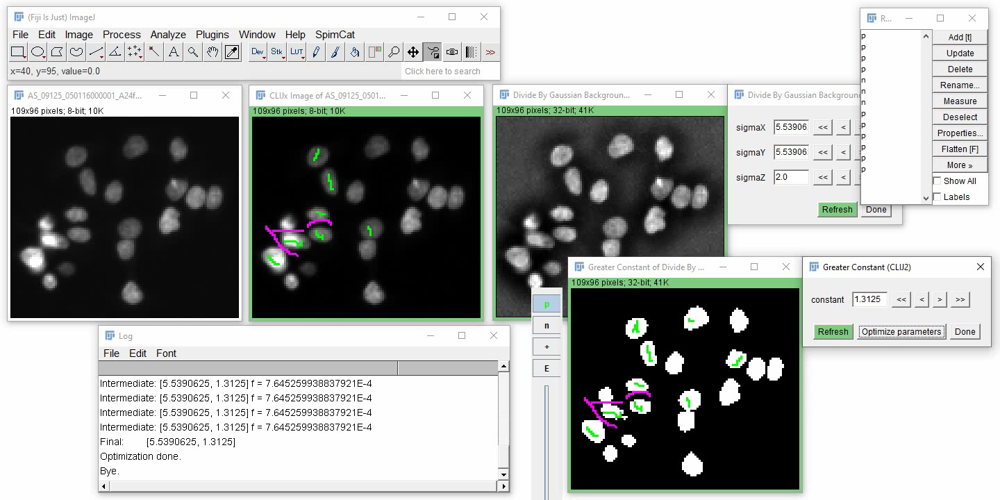
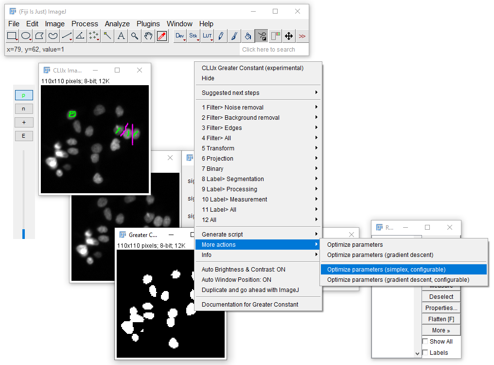
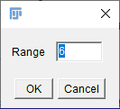
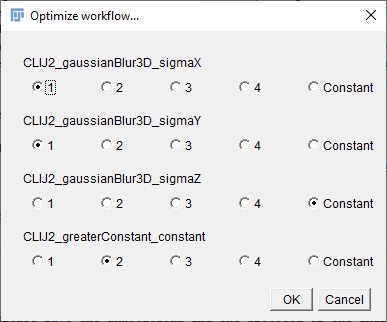
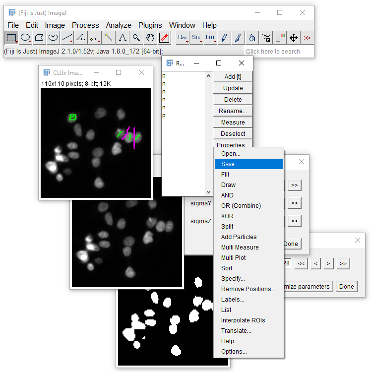

# Parameter optimization for binarization operations
If a workflow results in a binary image and some annotations are availabe, its parameters can be automatically optimized.

To prepare the optimization, draw Freehand or Polyline ROIs and store them in the ROI Manager. 
Name the positive annotations "p" and the negative annotations "n" (background).
If the ROI manager doesn't contain any annotations, it will open and start the annotation tool which is very similar to ImageJs Freehand tool.
Use the mouse to annotate positive regions and they will automatically be saved to the ROI manger with the correct name.
If you hold CTRL while drawing, they will be stored as negative/background annotations in the ROI manager.

When annotations are ready, click the "Optimize parameters" button:

<iframe src="images/optimize.mp4" width="600" height="300"></iframe>
[Download video](images/optimize.mp4) [Image data source: Broad BioImage Benchmark collection](https://bbbc.broadinstitute.org/BBBC008)

If optimization doesn't work so well, consider using a configurable optimizer:

It allows you to increase the optimization range of parameters. A range of 6 typically means it will optimize parameters 
starting from the large step size (also applied when clicking the `>>` button) times 2 to the power of -3 to 2 to the power of 3:
 

Furthermore, you can select which parameters should be optimized in groups (typically X and Y parameters should be grouped) and
which parameters should stay constant:

In case the optimization fails and you want to go back, use the [undo](https://clij.github.io/assistant/undo) functionality.

Last but not least, for good scientific practice, please save the annotations and the protocol of the analysis. 
Annotations can be saved using the `More >>` button in the ROI Manager:

The latter can be done by [exporting a script or human readable workflow](https://clij.github.io/assistant/macro_export).

Back to [CLIJx-Assistant](https://clij.github.io/assistant)

[Imprint](https://clij.github.io/imprint)
