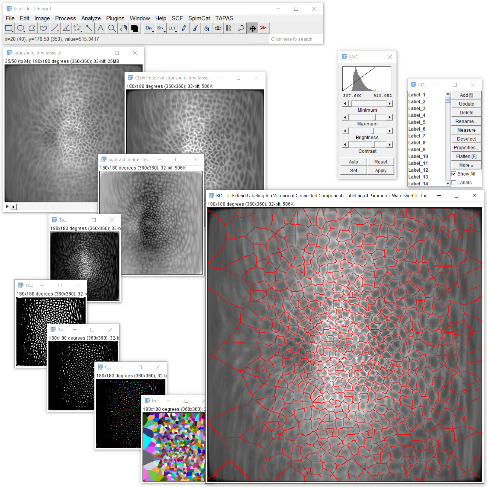

# Cell segmentation based on membrane markers
Cell segmentation based on membrane markers is challenging because usually contrast between cell body and cell membrane is small.
To improve on this, typically background subtraction methods are applied, for example:
* Top Hat
* Subtract Gaussian Background
* Difference of Gaussian

For increasing thickness of membranes a maximum filter may be helpful

An important step afterwards is typically inverting the image, for example with:
* Subtract Image from scalar
* Invert

Furthermore, spot detection techniques are applied to determine cell centers, for example:
* Find and label maxima
* Detect and label maxima

Alternatively, thresholding methods may also be able to differentiate cell body and cell memranes, for example:
* Threshold DoG, which is a combination of Difference of Gaussian and manual thresholding

Afterwards, labels as extended to mimic cell extesions, e.g.
* Extend labels with maximum Radius
* Extend labels via Voronoi

It is recommended to utilize modern [GDDR6-based GPU hardware](https://clij.github.io/assistant/installation#hardware) for 3D segmentation.

## How to do cell segmentation
Open your data set. [Start the CLIJx-Assistant](https://clij.github.io/assistant/getting_started) and follow such a workflows:

* Your dataset
  * CLIJx-Assistant Starting point
    * [Optional: Noise removal]
      * Subtract Image From Scalar 
        * Top Hat 
          * Threshold DoG 
            * Parametric Watershed 
              * Connected Components Labeling 
                * Extend Labeling Via Voronoi 
                  * Pull To ROIManager 
      
After assembling your workflow, tune the parameters. Usually, only small values for sigma and radii are needed when segmenting cells based on 

[Image data source: Daniela Vorkel, Myers lab, CSBD / MPI CBG]

## Example workflow
```
This protocol documents an image processing workflow using CLIJx-Assistant.
Read more about it online: https://clij.github.io/incubator/ 

Overview
 * Copy 
   * Subtract Image From Scalar 
     * Top Hat 
       * Threshold DoG 
         * Parametric Watershed 
           * Connected Components Labeling 
             * Extend Labeling Via Voronoi 
               * Pull To ROIManager 

We start by processing the image "strausberg_timelapse.tif" for simplicity, we call it image1.


As the next step we applied "Assistant Starting Point" on image1 and got a new image out, 
image2, also titled "CLIJx Image of strausberg_timelapse.tif".
.

Following, we applied "Generic Assistant Plugin" on image2 and got a new image out, 
image3, also titled "Subtract Image From Scalar of CLIJx Image of strausberg_timelapse.tif".
In detail,  we used the parameter scalar = 255.0.

As the next step we applied "Generic Assistant Plugin" on image3 and got a new image out, 
image4, also titled "Top Hat of Subtract Image From Scalar of CLIJx Image of strausberg_timelapse.tif".
In order to do so,  we used the parameters radiusX = 10.0, radiusY = 10.0 and radiusZ = 10.0.

As the next step we applied "Generic Assistant Plugin" on image4 and got a new image out, 
image5, also titled "Threshold DoG of Top Hat of Subtract Image From Scalar of CLIJx Image of strausberg_timelapse.tif".
Therefore,  we used the parameters sigma1 = 1.0, sigma2 = 3.0, threshold = 10.0 and above_threshold = 1.0.

Afterwards, we applied "Generic Assistant Plugin" on image5 and got a new image out, 
image6, also titled "Parametric Watershed of Threshold DoG of Top Hat of Subtract Image From Scalar of CLIJx Image of strausberg_timelapse.tif".
Therefore,  we used the parameters sigma_x = 2.0, sigma_y = 2.0 and sigma_z = 2.0.

Following, we applied "Generic Assistant Plugin" on image6 and got a new image out, 
image7, also titled "Connected Components Labeling of Parametric Watershed of Threshold DoG of Top Hat of Subtract Image From Scalar of CLIJx Image of strausberg_timelapse.tif".
.

Then, we applied "Generic Assistant Plugin" on image7 and got a new image out, 
image8, also titled "Extend Labeling Via Voronoi of Connected Components Labeling of Parametric Watershed of Threshold DoG of Top Hat of Subtract Image From Scalar of CLIJx Image of strausberg_timelapse.tif".
.

As the next step we applied "Pull To ROIManager" on image8 and got a new image out, 
image9, also titled "ROIs of Extend Labeling Via Voronoi of Connected Components Labeling of Parametric Watershed of Threshold DoG of Top Hat of Subtract Image From Scalar of CLIJx Image of strausberg_timelapse.tif".
.


```

## Example Macro

```
// To make this script run in Fiji, please activate 
// the clij and clij2 update sites in your Fiji 
// installation. Read more: https://clij.github.io

// Init GPU
run("CLIJ2 Macro Extensions", "cl_device=");

// Overview
//  * Copy 
//    * Subtract Image From Scalar 
//      * Top Hat 
//        * Threshold DoG 
//          * Parametric Watershed 
//            * Connected Components Labeling 
//              * Extend Labeling Via Voronoi 
//                * Pull To ROIManager 
// 
image1 = "strausberg_timelapse.tif";
Ext.CLIJ2_push(image1);

// Assistant Starting Point
// image1 = "strausberg_timelapse.tif";
// image2 = "CLIJx Image of strausberg_timelapse.tif";
Ext.CLIJ2_copy(image1, image2);
Ext.CLIJ2_pull(image2); // consider removing this line if you don't need to see that image

// Generic Assistant Plugin
// image2 = "CLIJx Image of strausberg_timelapse.tif";
// image3 = "Subtract Image From Scalar of CLIJx Image of strausberg_timelapse.tif";
scalar = 255.0;
Ext.CLIJ2_subtractImageFromScalar(image2, image3, scalar);
Ext.CLIJ2_pull(image3); // consider removing this line if you don't need to see that image

// Generic Assistant Plugin
// image3 = "Subtract Image From Scalar of CLIJx Image of strausberg_timelapse.tif";
// image4 = "Top Hat of Subtract Image From Scalar of CLIJx Image of strausberg_timelapse.tif";
radiusX = 10.0;
radiusY = 10.0;
radiusZ = 10.0;
Ext.CLIJ2_topHatBox(image3, image4, radiusX, radiusY, radiusZ);
Ext.CLIJ2_pull(image4); // consider removing this line if you don't need to see that image

// Generic Assistant Plugin
// image4 = "Top Hat of Subtract Image From Scalar of CLIJx Image of strausberg_timelapse.tif";
// image5 = "Threshold DoG of Top Hat of Subtract Image From Scalar of CLIJx Image of strausberg_timelapse.tif";
sigma1 = 1.0;
sigma2 = 3.0;
threshold = 10.0;
above_threshold = 1.0;
Ext.CLIJx_thresholdDoG(image4, image5, sigma1, sigma2, threshold, above_threshold);
Ext.CLIJ2_pull(image5); // consider removing this line if you don't need to see that image

// Generic Assistant Plugin
// image5 = "Threshold DoG of Top Hat of Subtract Image From Scalar of CLIJx Image of strausberg_timelapse.tif";
// image6 = "Parametric Watershed of Threshold DoG of Top Hat of Subtract Image From Scalar of CLIJx Image of strausberg_timelapse.tif";
sigma_x = 2.0;
sigma_y = 2.0;
sigma_z = 2.0;
Ext.CLIJx_parametricWatershed(image5, image6, sigma_x, sigma_y, sigma_z);
Ext.CLIJ2_pull(image6); // consider removing this line if you don't need to see that image

// Generic Assistant Plugin
// image6 = "Parametric Watershed of Threshold DoG of Top Hat of Subtract Image From Scalar of CLIJx Image of strausberg_timelapse.tif";
// image7 = "Connected Components Labeling of Parametric Watershed of Threshold DoG of Top Hat of Subtract Image From Scalar of CLIJx Image of strausberg_timelapse.tif";
Ext.CLIJ2_connectedComponentsLabelingBox(image6, image7);
Ext.CLIJ2_pull(image7); // consider removing this line if you don't need to see that image

// Generic Assistant Plugin
// image7 = "Connected Components Labeling of Parametric Watershed of Threshold DoG of Top Hat of Subtract Image From Scalar of CLIJx Image of strausberg_timelapse.tif";
// image8 = "Extend Labeling Via Voronoi of Connected Components Labeling of Parametric Watershed of Threshold DoG of Top Hat of Subtract Image From Scalar of CLIJx Image of strausberg_timelapse.tif";
Ext.CLIJ2_extendLabelingViaVoronoi(image7, image8);
Ext.CLIJ2_pull(image8); // consider removing this line if you don't need to see that image

// Pull To ROIManager
// image8 = "Extend Labeling Via Voronoi of Connected Components Labeling of Parametric Watershed of Threshold DoG of Top Hat of Subtract Image From Scalar of CLIJx Image of strausberg_timelapse.tif";
// image9 = "ROIs of Extend Labeling Via Voronoi of Connected Components Labeling of Parametric Watershed of Threshold DoG of Top Hat of Subtract Image From Scalar of CLIJx Image of strausberg_timelapse.tif";
Ext.CLIJ2_pullToROIManager(image8, image9);
Ext.CLIJ2_pull(image9); // consider removing this line if you don't need to see that image


```


Back to [CLIJx-Assistant](https://clij.github.io/assistant)

[Imprint](https://clij.github.io/imprint)
