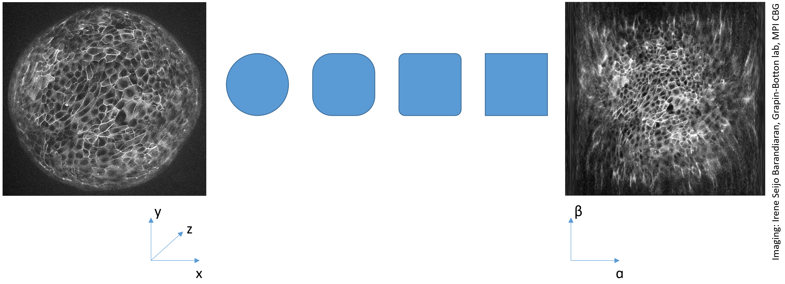
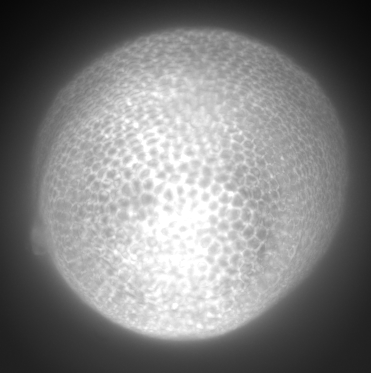
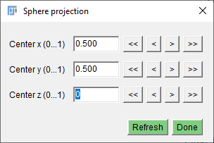
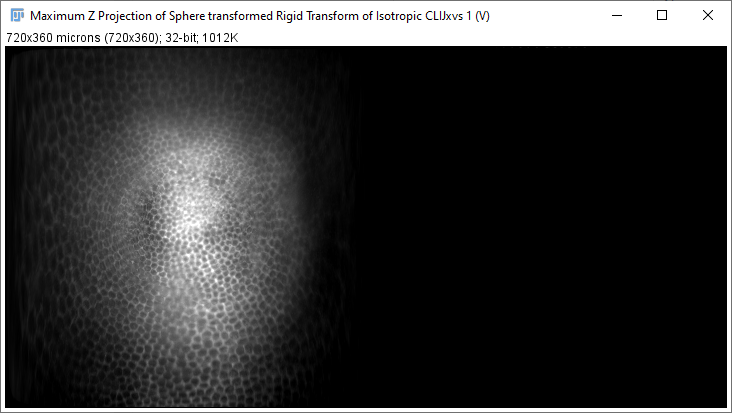
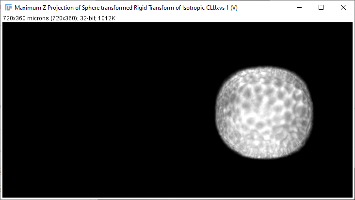

# Sphere projection
Similar to the [Cylinder projection](https://clij.github.io/assistant/cylinder_projection) 
we can use a sphere projection to project intensities from a spherical sample into a 2D image. 

## How to use a sphere projection on your data
When applying sphere projections to image stacks, a rigid dransform in advance is helpful to have control of the position and tilt of your sample in projected space.

Open your time lapse data set. [Start the CLIJx-Assistant](https://clij.github.io/assistant/getting_started) and follow these steps:

* Your dataset
  * CLIJx-Assistant Starting point
    * [Optional: Noise removal and Background subtraction]
      * Make Isotropic
        * Rigid transform
          * Sphere transform
            * Maximum Z projection

After assembling your workflow, put the last three operations next to each other, change the parameters of the 
rigid transform and inspect the results in the maximum Z projection.

<iframe src="images/incubator_rigid_sphere_projection.mp4" width="540" height="540"></iframe>
[Download video](images/Assistant_rigid_sphere_projection.mp4) 
[Image data source: Irene Seijo Barandiaran, Grapin-Botton lab, MPI CBG]

# Half-sphere projection
In case of datasets which are more similar to a half-sphere, e.g. a Tribolium castaneum embryo imaged from anterior to posterior, 
it may make sense to draw a half-sphere projection.

 

Stack view and corresponding maximum Z projection [Image data source: Daniela Vorkel, Myers lab, CSBD / MPI CBG]

This can be achieved by moving the center of the transform to the front (0) or back (1) of the image stack.

This will result in a transformed stack like this:

[Image data source: Daniela Vorkel, Myers lab, CSBD / MPI CBG]

And the maximum projection looks like this:

[Image data source: Daniela Vorkel, Myers lab, CSBD / MPI CBG]

If the maximum-Z-projection looks like this, the center is on the wrong end of the stack:

[Image data source: Daniela Vorkel, Myers lab, CSBD / MPI CBG]

Back to [CLIJx-Assistant](https://clij.github.io/assistant)

[Imprint](https://clij.github.io/imprint)
