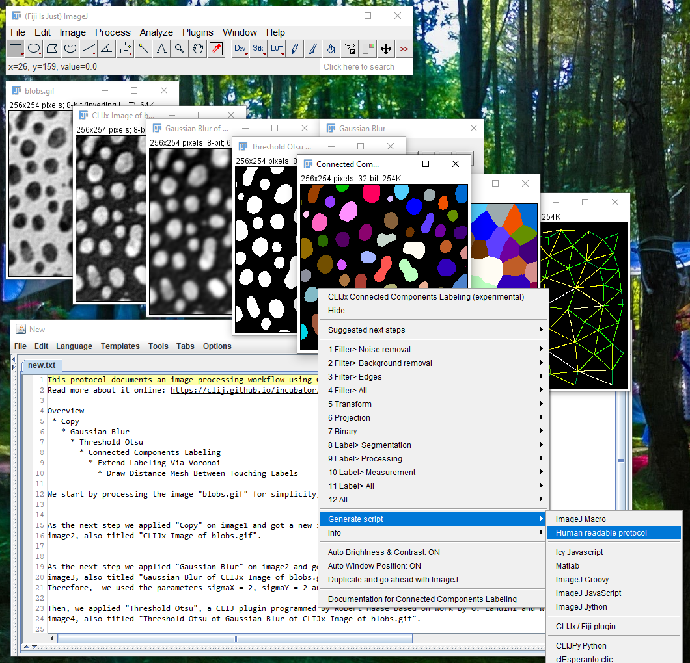

## Export human readable protocols
Just like [generating scripts](https://clij.github.io/assistant/macro_export), one can also
generate human readable protocols of workflows. Just click the right-click menu `Generate Script > Human readable protocol`.

Note: As modern reference / citation checking tools might detect these generated texts as illegal citations, it is 
recommended to mark these texts as generated.

## ImageJ Macro Markdown Notebooks

You can also export your workflow as notebook using the right-click menu `Generate Script > ImageJ Macro Markdown`:
<iframe src="images/ijmmd.mp4" width="540" height="540"></iframe>
[Download video](images/ijmmd.mp4) 

Back to [CLIJx-Assistant](https://clij.github.io/assistant)

[Imprint](https://clij.github.io/imprint)
