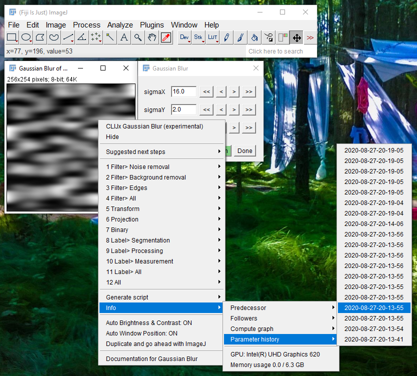

# Undo parameter changes
After every parameter change, all parameters of the current operation + all predecessors are saved to the parameter history. 
You can go back to former parameter settings by selecting the setting from the `Info > Parameter history` menu.

<iframe src="images/undo.mp4" width="500" height="250"></iframe>
[Download video](images/undo.mp4)

Back to [CLIJx-Assistant](https://clij.github.io/assistant)

[Imprint](https://clij.github.io/imprint)
